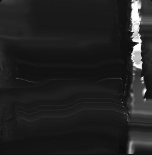
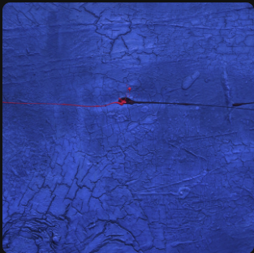
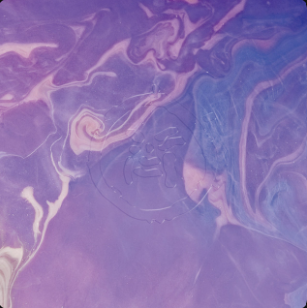
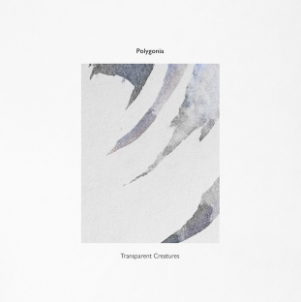
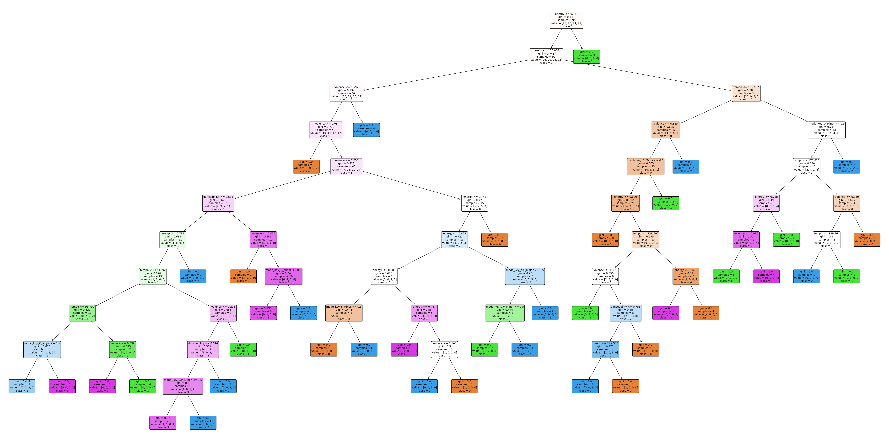
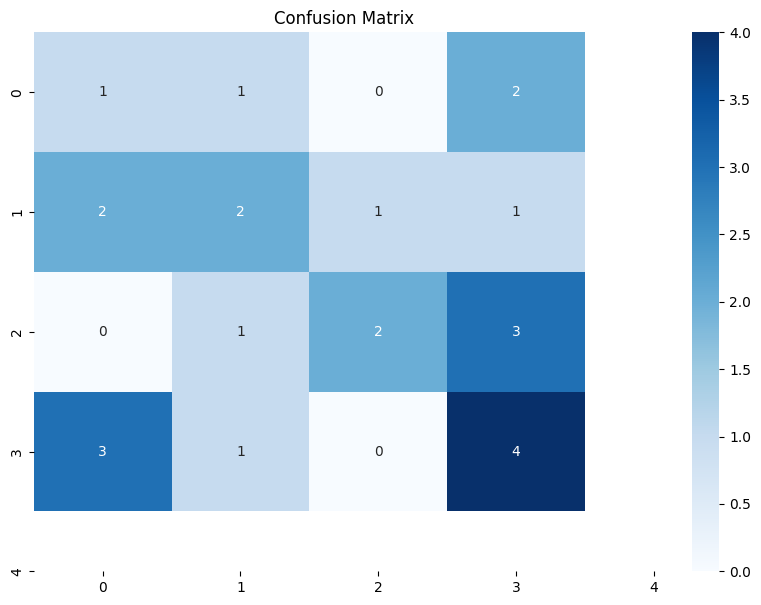

```{r}
library(tidyverse)
library(spotifyr)
library(compmus)
library(recipes)
library(rsample)
library(heatmaply)
library(tidymodels)
library(ggdendro)
library(parsnip)
library(workflows)
library(yardstick)
library(rsample)
library(workflows)
library(kknn)
library(yardstick)

get_conf_mat <- function(fit) {
  outcome <- .get_tune_outcome_names(fit)
  fit |> 
    collect_predictions() |> 
    conf_mat(truth = outcome, estimate = .pred_class)
}  

get_pr <- function(fit) {
  fit |> 
    conf_mat_resampled() |> 
    group_by(Prediction) |> mutate(precision = Freq / sum(Freq)) |> 
    group_by(Truth) |> mutate(recall = Freq / sum(Freq)) |> 
    ungroup() |> filter(Prediction == Truth) |> 
    select(class = Prediction, precision, recall)
}  

```

Introduction
======================


The corpus I selected is a pool of music tracks i used for DJ sets previously, mainly include deep/ambient techno music. My main interest is to explore the relationship between the design and color themes of the music album covers and the content of the music itself. I chose this topic because I believe that the organic character of this music genre and inspiration from nature would often evoke particular imagery or emotions, which is tightly linked with colors. Additionally a few of the artists are also visual artists, so their album cover designs should strongly align with the music content. 

I categorized the music tracks in four categories :  [Black](https://open.spotify.com/playlist/36pH6ey9uoMBnZDj4pAXyv?si=22bf965cd83f4544), [White](https://open.spotify.com/playlist/0SqwX4Y54AjbnXsha6QU4I?si=2a0794b0c2594542), [Blue](https://open.spotify.com/playlist/0wtw9NQFVy2zMQxZ8BAe5T?si=3fe2253f1a614bbf) and [Pink](https://open.spotify.com/playlist/2OZ42DxmlNZUua113zuz1A?si=efe207dd11994f21),  with 30 tracks in each category. When selecting songs, I also consider my own auditory perception, which is the idea of whether a song "gives me the vibe of this color." From my own perspective, the songs with black color give me a sense of depth and mystery, reminding me of mountains, forests, and rocks at night. The songs in the blue playlist always remind me of the ocean, in the playlist I selected there are also songs with titles "the sea breathe" and "underwater acoustic." The songs in the pink playlist are brighter and warmer, like the sunset on the horizon or cherry blossoms. The songs in the white playlist give a more ethereal feeling, connecting with an imagined world, such as the songs "transparent creature" and "River words."

Can these subjective and imaginative perceptions can be reflected and identified from quantifiable music features? This is the question that I am most interested in exploring. I hypothesize that bright and clear color themes on album covers would correspond to brighter music, while darker and more ambiguous cover themes may align with deeper and lower-frequency music. However, I am still uncertain about how other features such as rhythm and melody correspond to more abstract perceptions.

{width=275 height=150} {width=275 height=150} {width=275 height=150} {width=275 height=150}


```{r}
black <- get_playlist_audio_features("spotify", "36pH6ey9uoMBnZDj4pAXyv")
blue <- get_playlist_audio_features("spotify", "0wtw9NQFVy2zMQxZ8BAe5T")
pink <- get_playlist_audio_features("spotify", "2OZ42DxmlNZUua113zuz1A")
white <- get_playlist_audio_features("spotify", "0SqwX4Y54AjbnXsha6QU4I")
music <-
  bind_rows(
    black |> mutate(playlist = "Black"),
    blue |> mutate(playlist = "Blue") ,
    pink |> mutate(playlist = "Pink"),
    white |> mutate(playlist = "White")
  ) |> 
  add_audio_analysis()
```

```{r}
music_features <-
  music |>  
  mutate(
    playlist = factor(playlist),
    segments = map2(segments, key, compmus_c_transpose),
    pitches =
      map(
        segments,
        compmus_summarise, pitches,
        method = "mean", norm = "manhattan"
      ),
    timbre =
      map(
        segments,
        compmus_summarise, timbre,
        method = "mean",
      )
  ) |>
  mutate(pitches = map(pitches, compmus_normalise, "clr")) |>
  mutate_at(vars(pitches, timbre), map, bind_rows) |>
  unnest(cols = c(pitches, timbre))
```

Overview of the audio features {.storyboard}
======================

### Playlist features heatmap

```{r}
# Calculate the average values for each playlist
playlist_avg <- music %>%
  group_by(playlist_name) %>%
  summarize(avg_energy = mean(energy),
            avg_valence = mean(valence),
            avg_danceability = mean(danceability),
            avg_loudness = (mean(loudness) - min(loudness)) / (max(loudness) - min(loudness)))  # Scaling loudness

# Create a long format for the data
playlist_avg_long <- playlist_avg %>%
  pivot_longer(cols = starts_with("avg"), names_to = "Attribute", values_to = "Value")

# Create a heatmap
heatmap <- ggplot(playlist_avg_long, aes(x = playlist_name, y = Attribute, fill = Value)) +
  geom_tile() +
  scale_fill_gradient(low = "lightyellow", high = "darkblue") +  # You can adjust the color gradient as needed
  labs(title = "Playlist Attributes Heatmap",
       x = "Playlist Name",
       y = "Attribute") +
  theme_minimal() +
  theme(axis.text.x = element_text(angle = 45, hjust = 1))

# Print the heatmap
print(heatmap)
```

***
I created a heatmap with the average value of the different audio features in different playlists. From this graph we can see that the corpus overall has a low valence level and high energy and danceability. The loudness value is been scaled from 0 to 1. The pink playlist has a higher valence and loudness compare to other playlists. The blue playlist has the highest energy value. And the black and white playlist have a relatively high daceability. As the corpus is electornic music, it has very high instrumentalness level and low acousticness level in all four playlists so these attributes are not invovled in this heatmap.


### Valence-Energy graph

```{r}
library(gridExtra)
library(ggplot2)
theme_set(theme(panel.background = element_rect(fill = "transparent")))
# 创建四个ggplot对象
pink_plot <- ggplot(pink, aes(x = valence, y = energy)) +
  geom_point() + geom_smooth() +
  coord_cartesian(xlim = c(0,0.8), ylim = c(0, 1)) +
  ggtitle("Pink") +
  theme(plot.title = element_text(hjust = 0.5))
black_plot <- ggplot(black, aes(x = valence, y = energy)) +
  geom_jitter() + geom_smooth() +
  coord_cartesian(xlim = c(0,0.8), ylim = c(0, 1)) +
  ggtitle("Black") +
  theme(plot.title = element_text(hjust = 0.5))

blue_plot <- ggplot(blue, aes(x = valence, y = energy)) +
  geom_jitter() + geom_smooth() +
  coord_cartesian(xlim = c(0,0.8), ylim = c(0, 1)) +
  ggtitle("Blue") +
  theme(plot.title = element_text(hjust = 0.5))

white_plot <- ggplot(white, aes(x = valence, y = energy)) +
  geom_jitter() + geom_smooth() +
  coord_cartesian(xlim = c(0,0.8), ylim = c(0, 1)) +
  ggtitle("White") +
  theme(plot.title = element_text(hjust = 0.5))

# 将ggplot对象转换为grob对象
pink_grob <- ggplotGrob(pink_plot)
black_grob <- ggplotGrob(black_plot)
blue_grob <- ggplotGrob(blue_plot)
white_grob <- ggplotGrob(white_plot)

# 将图形以四宫格的方式排列
grid.arrange(pink_grob, black_grob, blue_grob, white_grob, ncol = 2, nrow = 2,widths = c(0.5, 0.5), heights = c(0.5, 0.5))

```


***
From this graph we can see that the pink category has a combination of sounds with high energy and low valence, or high valence with relatively low energy. The black category has high energy, with valence spread out the scale, but mainly at a low level. The blue category has medium - high energy with medium valence. The white category has medium energy and low valence.


Self Similarity Matrices {.storyboard}
======================

### Pink

```{r, echo = FALSE, message = FALSE, bg = 'transparent', fig.width=10, fig.height=6}
library(tidyverse)
library(spotifyr)
library(compmus)
# Function to create self similarity matrix plot
create_similarity_plot <- function(track_id, title) {
  # Load audio analysis data
  audio_data <- get_tidy_audio_analysis(track_id) %>%
    compmus_align(bars, segments) %>%
    select(bars) %>%
    unnest(bars) %>%
    mutate(
      pitches = map(segments,
                     compmus_summarise, pitches,
                     method = "acentre", norm = "manhattan"),
      timbre = map(segments,
                   compmus_summarise, timbre,
                   method = "mean")
    )

  # Create self similarity matrices for Chroma and Timbre
  chroma_matrix <- audio_data %>%
    compmus_self_similarity(pitches, "aitchison") %>%
    mutate(d = d / max(d), type = "Chroma")

  timbre_matrix <- audio_data %>%
    compmus_self_similarity(timbre, "cosine") %>%
    mutate(d = d / max(d), type = "Timbre")

  # Plot self similarity matrices
  plot_chroma <- ggplot(
      chroma_matrix,
      aes(
        x = xstart + xduration / 2,
        width = xduration,
        y = ystart + yduration / 2,
        height = yduration,
        fill = d
      )
    ) +
    geom_tile() +
    coord_fixed() +
    scale_fill_viridis_c(guide = "none") +
    theme_classic() +
    theme(
      panel.background = element_rect(fill = "transparent", color = NA),
      plot.background = element_rect(fill = "transparent", color = NA)
    ) +
    labs(x = "", y = "") +
    ggtitle(paste0("Chroma Self Similarity Matrix - ", title))

  plot_timbre <- ggplot(
      timbre_matrix,
      aes(
        x = xstart + xduration / 2,
        width = xduration,
        y = ystart + yduration / 2,
        height = yduration,
        fill = d
      )
    ) +
    geom_tile() +
    coord_fixed() +
    scale_fill_viridis_c(guide = "none") +
    theme_classic() +
    theme(
      panel.background = element_rect(fill = "transparent", color = NA),
      plot.background = element_rect(fill = "transparent", color = NA)
    ) +
    labs(x = "", y = "") +
    ggtitle(paste0("Timbre Self Similarity Matrix - ", title))

  # Return list of plots
  list(plot_chroma, plot_timbre)
}

# Track IDs and titles
tracks <- list(
  c("2gwrqcmWu4qWeaLq5EfsnU", "Sakha - Infinity Remix"),
  c("1QMltlOuqCutdrl2ofMGrE", "Cirrus Apparition")
)
theme_set(theme(panel.background = element_rect(fill = "transparent")))

# Create plots for each track
plots <- lapply(tracks, function(track) {
  create_similarity_plot(track[1], track[2])
})

# Display plots in a grid layout
library(gridExtra)


grid.arrange(plots[[1]][[1]], plots[[1]][[2]], plots[[2]][[1]], plots[[2]][[2]], 
             ncol = 2, nrow = 2)
```  

***
For the pink playlist I created the chroma and timbre self similarity matrix for two songs: "Sakha-Infinity Remix" and "Cirrus Apparition". Overall the pink playlist shows clear structure of music in the self similarity matrix, as most of the matrices have dark checkerboard patterns. There is a main melody going throughout the song and some parts with some variations. For "Sakha" we can see 4 different parts in the track. The change of chroma and timbre are almost at the same time, and there is a fade out in the end.  For "Cirrus Apparition", the chroma is almost the same across the whole song, but from timbre there are two small segement at around 200s and 300s where variation happens.

[Click here to listen to Sakha-Infinity Remix](https://open.spotify.com/track/2gwrqcmWu4qWeaLq5EfsnU?si=dbba6e79772c48b0)<br>
[Click here to listen to Cirrus Apparition](https://open.spotify.com/track/1QMltlOuqCutdrl2ofMGrE?si=9daf50f2ec0e4fec)


### Blue

```{r, echo = FALSE, message = FALSE, bg = 'transparent', fig.width=10, fig.height=6}
library(tidyverse)
library(spotifyr)
library(compmus)
# Function to create self similarity matrix plot
create_similarity_plot <- function(track_id, title) {
  # Load audio analysis data
  audio_data <- get_tidy_audio_analysis(track_id) %>%
    compmus_align(bars, segments) %>%
    select(bars) %>%
    unnest(bars) %>%
    mutate(
      pitches = map(segments,
                     compmus_summarise, pitches,
                     method = "acentre", norm = "manhattan"),
      timbre = map(segments,
                   compmus_summarise, timbre,
                   method = "mean")
    )

  # Create self similarity matrices for Chroma and Timbre
  chroma_matrix <- audio_data %>%
    compmus_self_similarity(pitches, "aitchison") %>%
    mutate(d = d / max(d), type = "Chroma")

  timbre_matrix <- audio_data %>%
    compmus_self_similarity(timbre, "cosine") %>%
    mutate(d = d / max(d), type = "Timbre")

  # Plot self similarity matrices
  plot_chroma <- ggplot(
      chroma_matrix,
      aes(
        x = xstart + xduration / 2,
        width = xduration,
        y = ystart + yduration / 2,
        height = yduration,
        fill = d
      )
    ) +
    geom_tile() +
    coord_fixed() +
    scale_fill_viridis_c(guide = "none") +
    theme_classic() +
    theme(
      panel.background = element_rect(fill = "transparent", color = NA),
      plot.background = element_rect(fill = "transparent", color = NA)
    ) +
    labs(x = "", y = "") +
    ggtitle(paste0("Chroma Self Similarity Matrix - ", title))

  plot_timbre <- ggplot(
      timbre_matrix,
      aes(
        x = xstart + xduration / 2,
        width = xduration,
        y = ystart + yduration / 2,
        height = yduration,
        fill = d
      )
    ) +
    geom_tile() +
    coord_fixed() +
    scale_fill_viridis_c(guide = "none") +
    theme_classic() +
    theme(
      panel.background = element_rect(fill = "transparent", color = NA),
      plot.background = element_rect(fill = "transparent", color = NA)
    ) +
    labs(x = "", y = "") +
    ggtitle(paste0("Timbre Self Similarity Matrix - ", title))

  # Return list of plots
  list(plot_chroma, plot_timbre)
}

# Track IDs and titles
tracks <- list(
  c("6fr1g7TqyLtZC3WqSKovcb", "Underwater Acoustics"),
  c("4RjYatfHXAZOzRcXJAwMoy", "Cosi Lontano")
)
theme_set(theme(panel.background = element_rect(fill = "transparent")))

# Create plots for each track
plots <- lapply(tracks, function(track) {
  create_similarity_plot(track[1], track[2])
})

# Display plots in a grid layout
library(gridExtra)


grid.arrange(plots[[1]][[1]], plots[[1]][[2]], plots[[2]][[1]], plots[[2]][[2]], 
             ncol = 2, nrow = 2)
```  

***
For the blue playlist I created the chroma and timbre self similarity matrix for [Underwater Acoustics](https://open.spotify.com/track/6fr1g7TqyLtZC3WqSKovcb?si=518f50afe5b24bd1) and [Cosi Lontano](https://open.spotify.com/track/4RjYatfHXAZOzRcXJAwMoy?si=4b849e86f98b4a05). Overall I can see more difference in the structure of self similarity matrix for different tracks in this playlist. Some songs are more self consistent than the others. The two example I picked are on the two side of the spectrum. "Underwater Acoustics" shows a high similarity across the whole song in both chroma and timbre. It does has some variations in the middle, but the variation parts still maintain a relatively high similarity level to the other parts of the music. "Cosi lontano" on the other hand shows a lot of changes in chroma and timbre among the track. It still sounds very consistent when you listen to it because there is a base percussion remain the same, but there are also different other instruments going on top of that. 

### Black

```{r, echo = FALSE, message = FALSE, bg = 'transparent', fig.width=10, fig.height=6}
library(tidyverse)
library(spotifyr)
library(compmus)
# Function to create self similarity matrix plot
create_similarity_plot <- function(track_id, title) {
  # Load audio analysis data
  audio_data <- get_tidy_audio_analysis(track_id) %>%
    compmus_align(bars, segments) %>%
    select(bars) %>%
    unnest(bars) %>%
    mutate(
      pitches = map(segments,
                     compmus_summarise, pitches,
                     method = "acentre", norm = "manhattan"),
      timbre = map(segments,
                   compmus_summarise, timbre,
                   method = "mean")
    )

  # Create self similarity matrices for Chroma and Timbre
  chroma_matrix <- audio_data %>%
    compmus_self_similarity(pitches, "aitchison") %>%
    mutate(d = d / max(d), type = "Chroma")

  timbre_matrix <- audio_data %>%
    compmus_self_similarity(timbre, "cosine") %>%
    mutate(d = d / max(d), type = "Timbre")

  # Plot self similarity matrices
  plot_chroma <- ggplot(
      chroma_matrix,
      aes(
        x = xstart + xduration / 2,
        width = xduration,
        y = ystart + yduration / 2,
        height = yduration,
        fill = d
      )
    ) +
    geom_tile() +
    coord_fixed() +
    scale_fill_viridis_c(guide = "none") +
    theme_classic() +
    theme(
      panel.background = element_rect(fill = "transparent", color = NA),
      plot.background = element_rect(fill = "transparent", color = NA)
    ) +
    labs(x = "", y = "") +
    ggtitle(paste0("Chroma Self Similarity Matrix - ", title))

  plot_timbre <- ggplot(
      timbre_matrix,
      aes(
        x = xstart + xduration / 2,
        width = xduration,
        y = ystart + yduration / 2,
        height = yduration,
        fill = d
      )
    ) +
    geom_tile() +
    coord_fixed() +
    scale_fill_viridis_c(guide = "none") +
    theme_classic() +
    theme(
      panel.background = element_rect(fill = "transparent", color = NA),
      plot.background = element_rect(fill = "transparent", color = NA)
    ) +
    labs(x = "", y = "") +
    ggtitle(paste0("Timbre Self Similarity Matrix - ", title))

  # Return list of plots
  list(plot_chroma, plot_timbre)
}

# Track IDs and titles
tracks <- list(
  c("7kfAbcKnRajKOmuACF3dxl", "Living nowhere with..."),
  c("3QQDdRMzR8vDLZlJOQqBwx", "Dagaz-Delusional Circuits..")
)
theme_set(theme(panel.background = element_rect(fill = "transparent")))

# Create plots for each track
plots <- lapply(tracks, function(track) {
  create_similarity_plot(track[1], track[2])
})

# Display plots in a grid layout
library(gridExtra)


grid.arrange(plots[[1]][[1]], plots[[1]][[2]], plots[[2]][[1]], plots[[2]][[2]], 
             ncol = 2, nrow = 2)
```

***
For the black playlist I created the chroma and timbre self similarity matrix for "Living nowhere with messy pigeons" and "Dagaz-Delusional circuits remix". Overall there are more smaller segments and the changes happens more rapidly in the black playlist compare to the others. "Living nowhere with messy pigeons" is an intro so there are no drum beats. We can see both chroma and timbre varies a lot throughout the track. And there are smaller musical segments. In "Dagaz-Delusional Circuits Remix", we can see three major parts from the checkerboard patterns, but there are also always some smaller variations, represent by the straight light lines.

[Click here to listen to Living nowhere with messy pigeons](https://open.spotify.com/track/7kfAbcKnRajKOmuACF3dxl?si=ea1ec4aa96dc4986)<br>
[Click here to listen to Dagaz-Delusional circuits remix](https://open.spotify.com/track/3QQDdRMzR8vDLZlJOQqBwx?si=d806dc6d47614b4e)


### white

```{r, echo = FALSE, message = FALSE, bg = 'transparent', fig.width=10, fig.height=6}
library(tidyverse)
library(spotifyr)
library(compmus)
# Function to create self similarity matrix plot
create_similarity_plot <- function(track_id, title) {
  # Load audio analysis data
  audio_data <- get_tidy_audio_analysis(track_id) %>%
    compmus_align(bars, segments) %>%
    select(bars) %>%
    unnest(bars) %>%
    mutate(
      pitches = map(segments,
                     compmus_summarise, pitches,
                     method = "acentre", norm = "manhattan"),
      timbre = map(segments,
                   compmus_summarise, timbre,
                   method = "mean")
    )

  # Create self similarity matrices for Chroma and Timbre
  chroma_matrix <- audio_data %>%
    compmus_self_similarity(pitches, "aitchison") %>%
    mutate(d = d / max(d), type = "Chroma")

  timbre_matrix <- audio_data %>%
    compmus_self_similarity(timbre, "cosine") %>%
    mutate(d = d / max(d), type = "Timbre")

  # Plot self similarity matrices
  plot_chroma <- ggplot(
      chroma_matrix,
      aes(
        x = xstart + xduration / 2,
        width = xduration,
        y = ystart + yduration / 2,
        height = yduration,
        fill = d
      )
    ) +
    geom_tile() +
    coord_fixed() +
    scale_fill_viridis_c(guide = "none") +
    theme_classic() +
    theme(
      panel.background = element_rect(fill = "transparent", color = NA),
      plot.background = element_rect(fill = "transparent", color = NA)
    ) +
    labs(x = "", y = "") +
    ggtitle(paste0("Chroma Self Similarity Matrix - ", title))

  plot_timbre <- ggplot(
      timbre_matrix,
      aes(
        x = xstart + xduration / 2,
        width = xduration,
        y = ystart + yduration / 2,
        height = yduration,
        fill = d
      )
    ) +
    geom_tile() +
    coord_fixed() +
    scale_fill_viridis_c(guide = "none") +
    theme_classic() +
    theme(
      panel.background = element_rect(fill = "transparent", color = NA),
      plot.background = element_rect(fill = "transparent", color = NA)
    ) +
    labs(x = "", y = "") +
    ggtitle(paste0("Timbre Self Similarity Matrix - ", title))

  # Return list of plots
  list(plot_chroma, plot_timbre)
}

# Track IDs and titles
tracks <- list(
  c("2ZdufCnwqq7ixB1I053V6q", "Synergy-Jupetto Mix"),
  c("6sUC7aPsA3Yo6GvuMyeSyt", "River words")
)
theme_set(theme(panel.background = element_rect(fill = "transparent")))

# Create plots for each track
plots <- lapply(tracks, function(track) {
  create_similarity_plot(track[1], track[2])
})

# Display plots in a grid layout
library(gridExtra)


grid.arrange(plots[[1]][[1]], plots[[1]][[2]], plots[[2]][[1]], plots[[2]][[2]], 
             ncol = 2, nrow = 2)
```

***
In the similarity matrix for the white album, it shows similar patterns as the black since there are also smaller music segments and a lot of small variations. But it is overall more consistent compare to the black one. In "Synergy-Jupetto Mix" there are a lot of variations in chroma, because the melody was repeat playing with a change in key. The timbre has more gradual changes throughout the track, as we can see a horizontal shift from black to yellow. In "River words", there are more consistency in chroma, but some small variations in timbre. 

[Click here to listen to Synergy-Jupetto Mix](https://open.spotify.com/track/2ZdufCnwqq7ixB1I053V6q?si=0b64db6e75cc4ed0)<br>
[Click here to listen to River words](https://open.spotify.com/track/6sUC7aPsA3Yo6GvuMyeSyt?si=3f117d2141c348c9)

Key and chord {.storyboard}
======================

### Key histgram

```{r,echo = FALSE}

# Function to convert numeric key to music key
# Define function to convert numeric key to music key
convert_to_music_key <- function(key_numeric) {
  # Define a vector of music keys
  music_keys <- c("C", "C#", "D", "D#", "E", "F", "F#", "G", "G#", "A", "A#", "B")
  
  # Calculate the index of the music key based on the numeric key
  index <- (key_numeric %% 12) + 1
  
  # Return the corresponding music key
  return(music_keys[index])
}

# Convert numeric key to music key
music$music_key <- sapply(music$key, convert_to_music_key)

# Plot histogram of keys with music keys on x-axis
# Plot histogram of keys with music keys on x-axis
ggplot(music,aes(x = factor(music_key, levels = c("C", "C#", "D", "D#", "E", "F", "F#", "G", "G#", "A", "A#", "B")), fill = factor(mode), group = mode)) +
  geom_bar(data = subset(music, mode == 1 & playlist_name == "new_blue"), aes(y = ..count..), binwidth = 1, color = "black", fill = "blue", stat = "count") +
  geom_bar(data = subset(music, mode == 0 & playlist_name == "new_blue"), aes(y = ..count..), binwidth = 1, color = "black", fill = "lightblue", stat = "count") +
  geom_bar(data = subset(music, mode == 1 & playlist_name == "new_pink"), aes(y = ..count..), binwidth = 1, color = "black", fill = "#FF69B4", stat = "count") +
  geom_bar(data = subset(music, mode == 0 & playlist_name == "new_pink"), aes(y = ..count..), binwidth = 1, color = "black", fill = "#FFB6C1", stat = "count") +
  geom_bar(data = subset(music, mode == 1 & playlist_name == "new_black"), aes(y = ..count..), binwidth = 1, color = "black", fill = "black", stat = "count") +
  geom_bar(data = subset(music, mode == 0 & playlist_name == "new_black"), aes(y = ..count..), binwidth = 1, color = "black", fill = "grey", stat = "count") +
  geom_bar(data = subset(music, mode == 1 & playlist_name == "new_white"), aes(y = ..count..), binwidth = 1, color = "black", fill = "#FFFFD0", stat = "count") +
  geom_bar(data = subset(music, mode == 0 & playlist_name == "new_white"), aes(y = ..count..), binwidth = 1, color = "black", fill = "white", stat = "count") +
  labs(title = "Histogram of Keys by Key Type", x = "Music Key", y = "Frequency", fill = "Key Type") +
  facet_wrap(~ playlist_name, ncol = 2) +  # Separate histograms by playlist_id
  theme_minimal()

```

***
I compared the distribution of keys within the four categories, where the darker color represents the major key and the lighter color represents the minor key. There are more major keys in pink and blue playlists compared to the black and white ones, which might contribute to a higher valence or positive emotional tone. In the pink playlist, there is a higher variation in keys that the tracks are evenly distributed across different keys. The black playlist on the other hand, shows a more concentrated distribution of keys, particularly centered around G major and B minor. In the white playlist C# is presented much more compare to the other playlists. Overall there are a lot of variety in the sharp and flat pitch classes in my corpus, but this cannot be directly associate with the complexity or the valence of the music.

### Chordograms

```{r}
circshift <- function(v, n) {
  if (n == 0) v else c(tail(v, n), head(v, -n))
}

#      C     C#    D     Eb    E     F     F#    G     Ab    A     Bb    B
major_chord <-
  c(   1,    0,    0,    0,    1,    0,    0,    1,    0,    0,    0,    0)
minor_chord <-
  c(   1,    0,    0,    1,    0,    0,    0,    1,    0,    0,    0,    0)
seventh_chord <-
  c(   1,    0,    0,    0,    1,    0,    0,    1,    0,    0,    1,    0)

major_key <-
  c(6.35, 2.23, 3.48, 2.33, 4.38, 4.09, 2.52, 5.19, 2.39, 3.66, 2.29, 2.88)
minor_key <-
  c(6.33, 2.68, 3.52, 5.38, 2.60, 3.53, 2.54, 4.75, 3.98, 2.69, 3.34, 3.17)

chord_templates <-
  tribble(
    ~name, ~template,
    "Gb:7", circshift(seventh_chord, 6),
    "Gb:maj", circshift(major_chord, 6),
    "Bb:min", circshift(minor_chord, 10),
    "Db:maj", circshift(major_chord, 1),
    "F:min", circshift(minor_chord, 5),
    "Ab:7", circshift(seventh_chord, 8),
    "Ab:maj", circshift(major_chord, 8),
    "C:min", circshift(minor_chord, 0),
    "Eb:7", circshift(seventh_chord, 3),
    "Eb:maj", circshift(major_chord, 3),
    "G:min", circshift(minor_chord, 7),
    "Bb:7", circshift(seventh_chord, 10),
    "Bb:maj", circshift(major_chord, 10),
    "D:min", circshift(minor_chord, 2),
    "F:7", circshift(seventh_chord, 5),
    "F:maj", circshift(major_chord, 5),
    "A:min", circshift(minor_chord, 9),
    "C:7", circshift(seventh_chord, 0),
    "C:maj", circshift(major_chord, 0),
    "E:min", circshift(minor_chord, 4),
    "G:7", circshift(seventh_chord, 7),
    "G:maj", circshift(major_chord, 7),
    "B:min", circshift(minor_chord, 11),
    "D:7", circshift(seventh_chord, 2),
    "D:maj", circshift(major_chord, 2),
    "F#:min", circshift(minor_chord, 6),
    "A:7", circshift(seventh_chord, 9),
    "A:maj", circshift(major_chord, 9),
    "C#:min", circshift(minor_chord, 1),
    "E:7", circshift(seventh_chord, 4),
    "E:maj", circshift(major_chord, 4),
    "G#:min", circshift(minor_chord, 8),
    "B:7", circshift(seventh_chord, 11),
    "B:maj", circshift(major_chord, 11),
    "D#:min", circshift(minor_chord, 3)
  )

key_templates <-
  tribble(
    ~name, ~template,
    "Gb:maj", circshift(major_key, 6),
    "Bb:min", circshift(minor_key, 10),
    "Db:maj", circshift(major_key, 1),
    "F:min", circshift(minor_key, 5),
    "Ab:maj", circshift(major_key, 8),
    "C:min", circshift(minor_key, 0),
    "Eb:maj", circshift(major_key, 3),
    "G:min", circshift(minor_key, 7),
    "Bb:maj", circshift(major_key, 10),
    "D:min", circshift(minor_key, 2),
    "F:maj", circshift(major_key, 5),
    "A:min", circshift(minor_key, 9),
    "C:maj", circshift(major_key, 0),
    "E:min", circshift(minor_key, 4),
    "G:maj", circshift(major_key, 7),
    "B:min", circshift(minor_key, 11),
    "D:maj", circshift(major_key, 2),
    "F#:min", circshift(minor_key, 6),
    "A:maj", circshift(major_key, 9),
    "C#:min", circshift(minor_key, 1),
    "E:maj", circshift(major_key, 4),
    "G#:min", circshift(minor_key, 8),
    "B:maj", circshift(major_key, 11),
    "D#:min", circshift(minor_key, 3)
  )
```

```{r}
library(gridExtra)

sample1 <- get_tidy_audio_analysis("0aNMDYhIWGr0f5yjP6QkUk") %>%
  compmus_align(bars, segments) %>%
  select(bars) %>%
  unnest(bars) %>%
  mutate(
    pitches = map(segments,
                   compmus_summarise, pitches,
                   method = "mean", norm = "manhattan")
  )

plot1 <- sample1 %>%
  compmus_match_pitch_template(
    chord_templates,         # Change to chord_templates if described
    method = "euclidean",  # Try different distance metrics
    norm = "manhattan"     # Try different norms
  ) %>%
  ggplot(
    aes(x = start + duration / 2, width = duration, y = name, fill = d)
  ) +
  ggtitle("White: Dwelling")+
  geom_tile() +
  scale_fill_viridis_c(guide = "none") +
  theme_minimal() +
  labs(x = "Time (s)", y = "") +
  theme(axis.text.y = element_text(size = 5))

sample2 <- get_tidy_audio_analysis("5HyHcVDIdda1M2SsAPVszp") %>%
  compmus_align(bars, segments) %>%
  select(bars) %>%
  unnest(bars) %>%
  mutate(
    pitches = map(segments,
                  compmus_summarise, pitches,
                  method = "mean", norm = "manhattan")
  )

plot2 <- sample2 %>%
  compmus_match_pitch_template(
    chord_templates,         # Change to chord_templates if described
    method = "euclidean",  # Try different distance metrics
    norm = "manhattan"     # Try different norms
  ) %>%
  ggplot(
    aes(x = start + duration / 2, width = duration, y = name, fill = d)
  ) +
  ggtitle("Pink: Luna")+
  geom_tile() +
  scale_fill_viridis_c(guide = "none") +
  theme_minimal() +
  labs(x = "Time (s)", y = "") +
  theme(axis.text.y = element_text(size = 5))

sample3 <- get_tidy_audio_analysis("65Pm8aWmD5lwItcT2MQi0s") %>%
  compmus_align(bars, segments) %>%
  select(bars) %>%
  unnest(bars) %>%
  mutate(
    pitches = map(segments,
                  compmus_summarise, pitches,
                  method = "mean", norm = "manhattan")
  )

plot3 <- sample3 %>%
  compmus_match_pitch_template(
    chord_templates,         # Change to chord_templates if described
    method = "euclidean",  # Try different distance metrics
    norm = "manhattan"     # Try different norms
  ) %>%
  ggplot(
    aes(x = start + duration / 2, width = duration, y = name, fill = d)
  ) +
  ggtitle("Black: Descending")+
  geom_tile() +
  scale_fill_viridis_c(guide = "none") +
  theme_minimal() +
  labs(x = "Time (s)", y = "") +
  theme(axis.text.y = element_text(size = 5))

sample4 <- get_tidy_audio_analysis("5jqJW9tITDRc7gyJLxzTL8") %>%
  compmus_align(bars, segments) %>%
  select(bars) %>%
  unnest(bars) %>%
  mutate(
    pitches = map(segments,
                  compmus_summarise, pitches,
                  method = "mean", norm = "manhattan")
  )

plot4<- sample4 %>%
  compmus_match_pitch_template(
    chord_templates,         # Change to chord_templates if described
    method = "euclidean",  # Try different distance metrics
    norm = "manhattan"     # Try different norms
  ) %>%
  ggplot(
    aes(x = start + duration / 2, width = duration, y = name, fill = d)
  ) +
  ggtitle("Blue: Soave")+
  geom_tile() +
  scale_fill_viridis_c(guide = "none") +
  theme_minimal() +
  labs(x = "Time (s)", y = "") +
  theme(axis.text.y = element_text(size = 5))


grid.arrange(plot1, plot2, plot3, plot4, nrow = 2, ncol = 2)

```

***
I generated the chordograms for one of the most representative song track in each playlist. I applied euclidean distance metrics and manhattan norm. In the chordograms, there are more variations in the pink playlist. I displayed the one from the track [Luna](https://open.spotify.com/track/5HyHcVDIdda1M2SsAPVszp?si=b07f9d2894554b81), where there is a repeat pattern of slight shifting downwards and shifting back in chords. In [Soave](https://open.spotify.com/track/5jqJW9tITDRc7gyJLxzTL8?si=9134454be77848b5) from the blue playlist there are also some variation in the middle that deviate from the  main chord. The black ([Descending](https://open.spotify.com/track/65Pm8aWmD5lwItcT2MQi0s?si=fdad78a16e634b9e)) and white ([Dwelling](https://open.spotify.com/track/0aNMDYhIWGr0f5yjP6QkUk?si=a8dde56ef70342ec)) playlist have a relatively more stable chord pattern that is consistent throughout the track. 

Tempo {.storyboard}
======================

### Tempo histgram

```{r,echo = FALSE}
library(ggplot2)
library(gridExtra)

# Read playlist data from CSV file
playlist_data <- read.csv("spotify_playlist_features.csv", header = TRUE)
color_palette <- c("pink", "blue","black", "lightgrey")
# Function to plot tempo histogram for a playlist
plot_playlist_tempo_histogram <- function(playlist_name, playlist_data, xlim_range) {
  # Extract tempo values for the specified playlist name
  tempo_values <- playlist_data$tempo[playlist_data$playlist_name == playlist_name]
  
  # Create histogram with fixed x-axis range
  ggplot(data.frame(tempo = tempo_values), aes(x = tempo, fill = playlist_name)) +
    geom_histogram(binwidth = 5, fill = color_palette[playlist_name == unique(playlist_data$playlist_name)]) +
    labs(title = playlist_name,
         x = "Tempo (BPM)", y = "Frequency") +
    xlim(xlim_range)
}

# Get maximum and minimum tempo values across all playlists
max_tempo <- max(playlist_data$tempo)
min_tempo <- min(playlist_data$tempo)

# Define the common x-axis range
xlim_range <- c(min_tempo, max_tempo)

# Create empty list to store histograms
histograms <- list()

# Plot tempo histograms for each unique playlist name
unique_playlists <- unique(playlist_data$playlist_name)
for (playlist_name in unique_playlists) {
  histograms[[playlist_name]] <- plot_playlist_tempo_histogram(playlist_name, playlist_data, xlim_range)
}

# Arrange histograms on one page
grid.arrange(grobs = histograms, nrow = 2, ncol = 2)

```

***
The tempo histograms reveal that the tempo across all four corpora tends to center around 120 bpm. However, the distribution of the tempo in the blue playlist appears to be more scattered compared to the others, indicating a greater variability in tempo within that playlist. In contrast, the pink and white playlist shows a very concentrated tempo distribution centered at around 125 bpm. As the corpus also included a few intro and outro tracks, it can explain the outliers with a tempo at around 100.

### tempogram

```{r, echo = FALSE, message = FALSE, bg = 'transparent', fig.width=10, fig.height=6}
library(tidyverse)
library(spotifyr)
library(compmus)
```

```{r}
library(gridExtra)

blue <- get_tidy_audio_analysis("0JxYzv0KXh2XuC9EVANl9a")
blue_plot <- blue |>
  tempogram(window_size = 8, hop_size = 5, cyclic = TRUE) |>
  ggplot(aes(x = time, y = bpm, fill = power)) +
  ggtitle("blue") +
  geom_raster() +
  scale_fill_viridis_c(guide = "none") +
  labs(x = "Time (s)", y = "Tempo (BPM)") +
  theme_classic()

pink <- get_tidy_audio_analysis("0RG0F3JOQY6bQeXkXqTfCo")
pink_plot <- pink |>
  tempogram(window_size = 8, hop_size = 5, cyclic = TRUE) |>
  ggplot(aes(x = time, y = bpm, fill = power)) +
  ggtitle("pink") +
  geom_raster() +
  scale_fill_viridis_c(guide = "none") +
  labs(x = "Time (s)", y = "Tempo (BPM)") +
  theme_classic()

black <- get_tidy_audio_analysis("49gZg2qvjLBEmwRVMKNSmj")
black_plot <- black |>
  tempogram(window_size = 8, hop_size = 5, cyclic = TRUE) |>
  ggplot(aes(x = time, y = bpm, fill = power)) +
  ggtitle("black") +
  geom_raster() +
  scale_fill_viridis_c(guide = "none") +
  labs(x = "Time (s)", y = "Tempo (BPM)") +
  theme_classic()

white <- get_tidy_audio_analysis("1ZTDB5eXH3V6bV6ZotZGOe")
white_plot <- white |>
  tempogram(window_size = 8, hop_size = 5, cyclic = TRUE) |>
  ggplot(aes(x = time, y = bpm, fill = power)) +
  ggtitle("white") +
  geom_raster() +
  scale_fill_viridis_c(guide = "none") +
  labs(x = "Time (s)", y = "Tempo (BPM)") +
  theme_classic()

grid.arrange(
  ggplotGrob(blue_plot),
  ggplotGrob(pink_plot),
  ggplotGrob(black_plot),
  ggplotGrob(white_plot),
  nrow = 2, ncol = 2
)
```

***
I generated the tempogram for one song from each playlist. In the blue playlist there are a lot more variations in tempo compared to the other playlist. I plot the tempo graph for the song [The Sea Breathe](https://open.spotify.com/track/0JxYzv0KXh2XuC9EVANl9a?si=66e26d66d6bd4260). It shows an average slow tempo with a fade in and a fade out. The tempo depicted on the tempogram s not very ascertained because there are no drum beats in this track. For the pink playlist I created the tempogram for [Ofrenda - Alfred Czital Remix](https://open.spotify.com/track/0RG0F3JOQY6bQeXkXqTfCo?si=50e4500438cf41f1), it has a much higher tempo at around 135, and the tempo is very clear and consistent. With black playlist ([Court of light](https://open.spotify.com/track/49gZg2qvjLBEmwRVMKNSmj?si=8bd99f1d6d3f4bd2)) and white play list ([Transparent creatures](https://open.spotify.com/track/1ZTDB5eXH3V6bV6ZotZGOe?si=1a038975eed045b6)) it shows a similar pattern with an average tempo around 125.

Classification {.storyboard}
======================

### K-Nearest Neighbors (KNN) classifier 

```{r}
music_recipe <- 
  recipe(
    playlist ~
      danceability +
      energy +
      loudness +
      speechiness +
      acousticness +
      instrumentalness +
      liveness +
      valence +
      tempo +
      mode + 
      key +
      duration +
      C + `C#|Db` + D + `D#|Eb` +
      E + `F` + `F#|Gb` + G +
      `G#|Ab` + A + `A#|Bb` + B +
      c01 + c02 + c03 + c04 + c05 + c06 +
      c07 + c08 + c09 + c10 + c11 + c12,
    data = music_features
  ) %>%
  step_center(all_predictors()) %>%# Converts to z-scores.
  step_scale(all_predictors())# Sets range to [0, 1].
```

```{r}
music_cv <- music_features |> vfold_cv(5)
```


```{r}
knn_model <-
  nearest_neighbor(neighbors = 1) |>
  set_mode("classification") |> 
  set_engine("kknn")
music_knn <- 
  workflow() |> 
  add_recipe(music_recipe) |> 
  add_model(knn_model) |> 
  fit_resamples(music_cv, control = control_resamples(save_pred = TRUE))
```

```{r}
music_knn |> get_conf_mat() |> autoplot(type = "heatmap")
```

```{r,echo = FALSE,results='hide'}
# Calculate accuracy
accuracy <- music_knn %>%
  collect_predictions() %>%
  metrics(truth = playlist, estimate = .pred_class) %>%
  filter(.metric == "accuracy") %>%
  pull(.estimate)

```
***
I applied a K-Nearest Neighbors (KNN) classifier to distinguish the four playlists with different music album color. From the result we can see that the classifier is relatively more effective at identifying music in a white color album, and it has very low performance when identifying blue album. However the overall accuracy is only 20%, which means the probability of accurate prediction is lower than chance. It implies that either there is no clear difference in music with different color albums, or the differences can't be identified from spotify api features.


### CART Decision Tree 

{width=800 height=650}

***

By using CART Decision tree for classification task, the accuracy raised to 37.5%.{width=275 height=275}This classifier is very good at identify black playlists. The most important features identified by the classifier are: mode_key, energy, valence and tempo. However since the sample size is very small, the classifier might be over fitting the sample data instead of detecting the general pattern to identify color from audio features.

Conclusion
======================

**1. Brighter hues, brighter melodies** 

Overall, this study explored the relation in musical features and album cover color in the genre of ambient techno. The music with a pink album cover shows higher valence level and loudness, while blue color songs shows low valence but higher energy level. Black and white color music have higher dancebility compare to the lighter color album.

**2. Color and musical structures** 

The self similarity matrices show that the pink color music have a clearer sturcture in the change of timbre and chroma, while the black and white color music have more rapid change and smaller musical segments. The blue album music have different type of musical structure in different tracks.  

**3. Color and variations**

By delving deeper into the key and tempo of the music. We can see that pink and blue album cover music shows more variations in audio features compare to the albums with black and white cover. The blue playlist shows more variation in tempo, and the pink playlist shows more variation in key and chords. 

**4. Can the "Mindless Machine" tell the color of music?**

Unfortunately, the two types of classifier I applied all can't achieve high accuracy in predicting the album cover color from the music features, which means it is hard to identify the differences in color from quantifiable features. Additionally, the selection of colors for music album covers is subjective, as individuals associate colors with music in their own unique ways. This is also influenced by their social and cultural background. Therefore, the low accuracy of mathematical models was expected.

**5. Limitation and next step**

Although this study discovered various patterns in music with different album cover color, the sample size and genre specificity may restrict the generalization of findings to broader populations. Additionally, I was not successful in translating abstract concepts into quantifiable music features. For the next step, I should focus more on understanding the psychological mechanisms underlying color-music associations and develop more robust models to exploring the intricate relationship between color and music.

